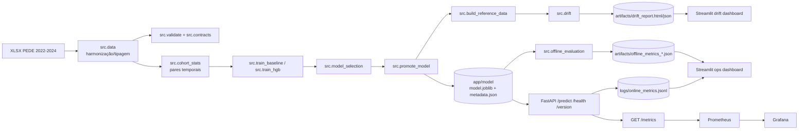

# FIAP Tech Challenge F5 - Predição de Risco de Defasagem Escolar

## Visão Geral
Este projeto implementa um sistema de Machine Learning para prever, no ano `t`, o risco de um estudante apresentar defasagem escolar em `t+1`.

O foco da entrega é **engenharia de ML em produção local**:
- pipeline temporal de treino/avaliação com anti-leakage;
- API FastAPI com contrato explícito e validações;
- observabilidade online (agregada, sem PII), monitoramento de drift e avaliação pós-fato;
- retreino/promoção/rollback locais com rastreabilidade de artefatos.

## Resumo Executivo (Leitura de 5 Minutos)
### Problema e objetivo
- Problema: classificação binária de risco de defasagem escolar futura.
- Target oficial: `y = 1` se `Defasagem_{t+1} < 0`; caso contrário `y = 0`.
- Recorte temporal oficial:
  - treino: `X(2022) -> y(2023)`
  - holdout: `X(2023) -> y(2024)`
- Métrica primária: **Recall** (minimizar falsos negativos).

### Entregas principais
- Ingestão e harmonização de schema entre `PEDE2022`, `PEDE2023`, `PEDE2024`.
- Data contracts versionados em `docs/contracts/`.
- Treino baseline + não linear, seleção de campeão e promoção para `app/model/`.
- API `/health`, `/version`, `/predict`, `/metrics`.
- Logging estruturado JSON e guardrails de privacidade (`src/privacy.py`).
- Drift report local (Evidently) + dashboards Streamlit (drift e operacional consolidado).
- Orquestrador local de retreino por tempo + drift (`src.retrain_orchestrator`).
- Não-regressão de modelo no CI (`src.regression_check`).

### Onde validar rapidamente
1. Subir API local: `bash scripts/run_api_local.sh`
2. Rodar smoke da API: `BASE_URL=http://127.0.0.1:8000 bash scripts/smoke_api_local.sh`
3. Rodar testes: `pytest -q`
4. Verificar contrato e qualidade: `python -m src.validate`
5. Verificar coorte temporal: `python -m src.cohort_stats`

## Estrutura do Projeto
```text
fiap-techchalenge-f5/
│
├── README.md                          # visão executiva, arquitetura, operação e execução local
├── rtr.md                             # roteiro da apresentação em vídeo
├── requirements.txt                   # dependências principais da API e runtime
├── requirements-dev.txt               # dependências de desenvolvimento e testes
├── requirements-dashboard.txt         # ambiente isolado para Streamlit + Evidently
├── docker-compose.observability.yml   # stack local de API + Prometheus + Grafana
│
├── app/
│   ├── main.py                        # FastAPI app + middleware + handlers globais
│   ├── routes.py                      # endpoints /health, /version, /predict, /metrics
│   ├── deps.py                        # carregamento lazy de modelo/metadata e contexto
│   ├── metrics.py                     # métricas Prometheus expostas em /metrics
│   ├── request_schemas.py             # validação estrutural do body de /predict
│   ├── schemas.py                     # contrato de saída da API
│   ├── predict_utils.py               # missing stats e gate anti-leakage
│   └── model/
│       ├── model.joblib               # campeão atualmente servido
│       ├── metadata.json              # versão, threshold e expected_raw_cols
│       └── reference/                 # referência de drift do modelo promovido
│
├── src/
│   ├── data.py                        # ingestão, harmonização e pares temporais
│   ├── validate.py                    # qualidade dos dados e validação de consistência
│   ├── contracts.py                   # export e versionamento de data contracts
│   ├── contract_validate.py           # validação dos frames contra contratos
│   ├── features.py                    # feature engineering RAW -> MODEL
│   ├── preprocessing.py               # imputação, codificação e transformação sklearn
│   ├── pipeline_components.py         # bundle reutilizável de pré-processamento/inferência
│   ├── train_baseline.py              # treino baseline (LogisticRegression)
│   ├── train_hgb.py                   # treino não linear (HistGradientBoosting)
│   ├── model_selection.py             # escolha formal do campeão
│   ├── promote_model.py               # staging/prod + backups de serving
│   ├── build_reference_data.py        # geração da referência de drift
│   ├── online_metrics.py              # métricas agregadas online
│   ├── offline_evaluation.py          # avaliação pós-fato quando o rótulo chega
│   ├── drift.py                       # relatório de drift com Evidently
│   ├── regression_check.py            # não-regressão do campeão baseada em metadata
│   ├── retention.py                   # limpeza local por TTL e keep-N
│   ├── retrain_orchestrator.py        # decisão e execução de retreino
│   ├── explainability.py              # importâncias globais + erro agregado
│   └── privacy.py                     # guardrails anti-PII
│
├── dashboards/
│   ├── streamlit_app.py               # visualização local do relatório de drift
│   └── ops_dashboard.py               # dashboard operacional consolidado
│
├── docs/
│   ├── analise_bases_e_dicionario.md  # leitura técnica das bases e dicionário
│   ├── column_mapping.md              # crosswalk de schema entre anos
│   ├── model_final_justification.md   # justificativa do campeão
│   ├── pipeline_ml_deep_dives.md      # detalhes técnicos fora do README principal
│   ├── retrain_policy.json            # política versionada de retreino
│   ├── evidencias_banca.md            # mapa de screenshots/evidências
│   └── contracts/                     # contratos versionados + changelog
│
├── scripts/
│   ├── run_api_local.sh               # sobe a API local via .venv
│   ├── smoke_api_local.sh             # smoke test da API local
│   ├── run_api_docker_local.sh        # atalho Docker para API
│   ├── bootstrap_dashboard_env.sh     # cria .venv-dashboard isolada
│   ├── populate_grafana_metrics.sh    # gera tráfego para popular os painéis
│   └── smoke_observability.sh         # smoke da stack Prometheus + Grafana
│
├── observability/
│   ├── prometheus/                    # configuração de scrape local
│   └── grafana/                       # datasource, dashboards e provisioning
│
├── artifacts/                         # saídas geradas localmente (métricas, drift, evidências)
├── logs/                              # logs e métricas online agregadas
├── tests/                             # suíte unitária e integrada
├── dataset/                           # materiais e base original do desafio
└── .github/
    └── workflows/                    # CI principal + smokes manuais de dashboard/observability
```

## Guia de Navegação
| Se você quer... | Leia primeiro |
|---|---|
| Entender a solução em alto nível | `Visão Geral`, `Arquitetura da Solução`, `Pipeline de ML` |
| Executar o projeto localmente | `Setup e Execução Local` |
| Integrar com a API | `Contrato da API em Produção` e `Exemplos de Chamadas` |
| Entender monitoramento e operação | `Operação em Produção`, `Dashboards`, `Observabilidade Opcional` |
| Ver riscos e limitações | `Limitações Conhecidas e Riscos Assumidos` |
| Montar slides/evidências da banca | `Evidências para Banca (sem embed de imagens)` |

## Arquitetura da Solução
### Diagrama (Mermaid)
A figura abaixo resume o fluxo ponta-a-ponta do projeto.



### Fluxo offline (treino e governança)
```text
XLSX (PEDE2022/2023/2024)
  -> ingestão + harmonização + tipagem + normalização
  -> validação de consistência + data contracts
  -> coorte temporal por RA + target t->t+1
  -> anti-leakage + feature engineering + preprocessor
  -> treino (baseline + HGB) e avaliação holdout
  -> seleção do campeão + promoção (staging/prod)
  -> referência para drift + relatórios operacionais
```

### Fluxo online (serving)
```text
POST /predict
  -> validação estrutural do request
  -> validação de contrato de colunas + gate anti-leakage
  -> RAW -> MODEL -> preprocessor -> predict_proba
  -> resposta com risk_proba/risk_class/threshold/model_version
  -> logging estruturado + métricas online agregadas
```

## Stack Tecnológica
### Runtime e ambientes
- Python recomendado: `3.11.9` (`.python-version`)
- Ambiente principal: `.venv` (pipeline, API, testes)
- Ambiente isolado dashboard: `.venv-dashboard` (Evidently + Streamlit)

### Bibliotecas principais
- Dados/ML: `pandas`, `scikit-learn`, `joblib`, `openpyxl`
- API: `FastAPI`, `uvicorn`, `pydantic v1`
- Qualidade: `pytest`, `pytest-cov`
- Monitoramento local: `evidently`, `streamlit`, `prometheus-client`

### Arquivos de dependências
- `requirements.txt`: runtime principal
- `requirements-dev.txt`: testes + ferramentas de dev
- `requirements-dashboard.txt`: stack isolada do dashboard

## Setup e Execução Local
### 1) Ambiente principal
```bash
python3 -m venv .venv
source .venv/bin/activate
pip install -r requirements-dev.txt
```

### 2) Dataset
- O dataset XLSX não é versionado no Git.
- Defina o caminho via variável de ambiente `DATASET_PATH` quando necessário.

Exemplo:
```bash
export DATASET_PATH="dataset/DATATHON/BASE DE DADOS PEDE 2024 - DATATHON.xlsx"
```

### 3) Checks básicos de dados
```bash
python -m src.validate
python -m src.cohort_stats
```

### 4) Pipeline de treino/seleção/promoção (resumo)
```bash
python -m src.train_baseline --dataset-path "$DATASET_PATH" --eval-holdout 1
python -m src.train_hgb --dataset-path "$DATASET_PATH" --eval-holdout 1
python -m src.model_selection --models-root artifacts/models --output-json artifacts/model_selection.json
python -m src.promote_model --selection-path artifacts/model_selection.json --models-root artifacts/models --out-dir app/model --force 1 --backup 1
```

### 5) Subir API local e validar
```bash
bash scripts/run_api_local.sh
```

Em outro terminal:
```bash
BASE_URL=http://127.0.0.1:8000 bash scripts/smoke_api_local.sh
```

### 6) Rodar API via Docker (atalho opcional)
```bash
AUTO_BUILD=1 bash scripts/run_api_docker_local.sh
```

## Pipeline de Machine Learning
| Etapa | Objetivo | Módulos principais | Saídas |
|---|---|---|---|
| Ingestão e harmonização | Normalizar schema entre anos | `src.data`, `src.schema`, `src.dtypes`, `src.categories`, `src.column_mapping` | Frames por ano alinhados |
| Contratos e validação | Garantir qualidade e consistência | `src.contracts`, `src.contract_validate`, `src.validate` | `artifacts/data_quality_report.json` |
| Coorte e target | Construir pares temporais e rótulo | `src.data`, `src.cohort_stats` | pares `t->t+1`, `y`, interseções |
| Modelagem | Treinar candidatos e comparar | `src.train_baseline`, `src.train_hgb`, `src.model_selection` | metadados por variante + campeão |
| Promoção | Publicar artefato de serving | `src.promote_model`, `src.model_versioning` | `app/model/model.joblib`, `app/model/metadata.json` |
| Drift/monitoramento | Referência e relatório de drift | `src.build_reference_data`, `src.drift` | `app/model/reference/*`, `artifacts/drift_report.*` |
| Avaliação pós-fato | Métricas quando `t+1` chega | `src.offline_evaluation` | `artifacts/offline_metrics_*.json/.md` |

## Contratos em Produção
### Data contracts
- Contratos versionados por ano em `docs/contracts/`.
- Exportação:
```bash
python -m src.contracts --export
```

### Contrato de payload (`POST /predict`)
Formatos aceitos:
1. objeto único: `{ "coluna_a": ..., "coluna_b": ... }`
2. lista de objetos: `[ {...}, {...} ]`
3. envelope: `{ "records": [ {...}, {...} ] }`

Regras principais:
- colunas esperadas vêm de `expected_raw_cols` no `metadata.json` do modelo em serving;
- extras leakage-like são bloqueados;
- por padrão, colunas faltantes retornam `400`;
- com `ALLOW_PARTIAL_PAYLOAD=1`, payload parcial é aceito e faltantes viram `NA`.

### Contrato de saída
Campos por predição:
- `risk_proba` (0 a 1)
- `risk_class` (0 ou 1)
- `threshold_applied`
- `model_version`
- `model_family`
- `variant`
- `decision_policy`
- `notes` (opcional)

## Exemplos de Chamadas à API
### Health e version
```bash
curl -s http://127.0.0.1:8000/health
curl -s http://127.0.0.1:8000/version
```

### Predict (objeto único)
```bash
curl -s -X POST http://127.0.0.1:8000/predict \
  -H "Content-Type: application/json" \
  -d '{"coluna_exemplo": 1}'
```

### Predict (envelope batch)
```bash
curl -s -X POST http://127.0.0.1:8000/predict \
  -H "Content-Type: application/json" \
  -d '{"records":[{"coluna_exemplo":1},{"coluna_exemplo":2}]}'
```

### Payload parcial para aluno novo
```bash
ALLOW_PARTIAL_PAYLOAD=1 bash scripts/run_api_local.sh
```

Observação:
- Esse modo depende das colunas esperadas no metadata do modelo.
- Faltantes entram como `NA` e são tratados pelo pipeline de imputação.

## Operação em Produção (Local)
### Logging estruturado e privacidade
- Logging JSON por padrão (`LOG_FORMAT=json`).
- Campos sensíveis (RA, Nome_Anon, Avaliadores etc.) são redigidos por guardrails centrais.
- Não logamos payload completo, IDs de alunos ou probabilidades individuais.

Variáveis úteis:
- `LOG_LEVEL` (default `INFO`)
- `LOG_FORMAT` (`json` ou `plain`)
- `LOG_TO_FILE` (`0/1`)
- `LOG_FILE_PATH` (default `logs/app.log`)

### Métricas online (sem rótulo)
- Arquivo: `logs/online_metrics.jsonl`
- Conteúdo agregado por request:
  - histograma de scores
  - positive rate no threshold operacional
  - missing rates
  - status family (`2xx`, `4xx`, `5xx`)

### Drift report (Evidently)
Pré-requisito: referência em `app/model/reference/`.

```bash
python -m src.drift \
  --reference-dir app/model/reference \
  --current-csv <current_model_frame.csv> \
  --out-html artifacts/drift_report.html \
  --out-json artifacts/drift_report_summary.json
```

### Métricas pós-fato (ground truth delay)
```bash
python -m src.offline_evaluation \
  --dataset-path "$DATASET_PATH" \
  --model-dir app/model \
  --year-t 2023 --year-t1 2024 \
  --out-json artifacts/offline_metrics_2023_2024.json \
  --out-md artifacts/offline_metrics_2023_2024.md
```

### Não-regressão do campeão (CI-friendly)
```bash
python -m src.regression_check \
  --selection-path artifacts/model_selection.json \
  --models-root artifacts/models
```

### Retenção de logs e artefatos locais
```bash
python -m src.retention --dry-run 1
python -m src.retention --dry-run 0
```

### Retreino automatizado (tempo + drift)
Policy versionada: `docs/retrain_policy.json`

Dry-run de decisão:
```bash
python -m src.retrain_orchestrator \
  --dataset-path "$DATASET_PATH" \
  --policy docs/retrain_policy.json \
  --execute 0
```

Execução real:
```bash
python -m src.retrain_orchestrator \
  --dataset-path "$DATASET_PATH" \
  --policy docs/retrain_policy.json \
  --execute 1 \
  --allow-recommended 1
```

### Explainability local do campeão
```bash
python -m src.explainability \
  --model-dir app/model \
  --dataset-path "$DATASET_PATH" \
  --year-t 2023 --year-t1 2024 \
  --out-json artifacts/explainability_report.json \
  --out-md artifacts/explainability_report.md
```

## Dashboards (Streamlit)
### Ambiente isolado recomendado
```bash
bash scripts/bootstrap_dashboard_env.sh .venv-dashboard python3.11
source .venv-dashboard/bin/activate
```

### Dashboard de drift (Evidently HTML)
```bash
streamlit run dashboards/streamlit_app.py
```

### Dashboard operacional consolidado
```bash
streamlit run dashboards/ops_dashboard.py
```

Entradas esperadas:
- online: `logs/online_metrics.jsonl`
- drift: `artifacts/drift_report.html` e `artifacts/drift_report_summary.json`
- pós-fato: `artifacts/offline_metrics_*.json`

## Observabilidade Opcional (Fase 9)
Stack local com Prometheus + Grafana:
```bash
docker compose -f docker-compose.observability.yml up --build
```

URLs:
- API: `http://localhost:8000`
- Metrics: `http://localhost:8000/metrics`
- Prometheus: `http://localhost:9090`
- Grafana: `http://localhost:3000`

Smoke automatizado:
```bash
bash scripts/smoke_observability.sh
```

## Qualidade e CI
### Testes locais
```bash
pytest -q
pytest -q --cov=src --cov-report=term-missing --cov-fail-under=80
```

### CI (GitHub Actions)
- `ci.yml`: testes + coverage + checks de validação/coorte + regression check
- `dashboard-smoke.yml` (manual): drift + Streamlit smoke
- `observability-smoke.yml` (manual): API + Prometheus + Grafana smoke

## Limitações Conhecidas e Riscos Assumidos
- `Fase_Ideal` apresenta inconsistências semânticas no dataset (ex.: idade igual com fases diferentes). Nesta versão, tratamos como categórica observada, sem recálculo por idade.
- Ground truth com atraso (`t+1`) exige separação entre monitoramento online e avaliação offline.
- Explainability fornecida é global/agregada; não é causal.
- Operação é local/acadêmica (sem cloud gerenciada).

## Evidências para Banca (sem embed de imagens)
As evidências visuais estão mapeadas e prontas para uso em apresentação, **sem incorporar imagens no README**.

- Mapeamento requisito -> screenshot: `docs/evidencias_banca.md`
- Diretório esperado das capturas locais: `artifacts/evidence_pack/screenshots/`
- Manifesto técnico da captura: `artifacts/evidence_pack/screenshots/capture_manifest.json`

## Documentação Detalhada (Deep Dives)
Para manter este README objetivo, os detalhes extensos ficam em `docs/`:

- análise das bases e dicionário: `docs/analise_bases_e_dicionario.md`
- mapeamento de colunas: `docs/column_mapping.md` e `docs/column_mapping.json`
- contratos versionados + changelog:
  - `docs/contracts/data_contract_2022.json`
  - `docs/contracts/data_contract_2023.json`
  - `docs/contracts/data_contract_2024.json`
  - `docs/contracts/CHANGELOG.md`
  - `docs/contracts/contracts_changelog.json`
- deep dive do pipeline: `docs/pipeline_ml_deep_dives.md`
- justificativa do modelo final: `docs/model_final_justification.md`
- política de retreino: `docs/retrain_policy.json`
